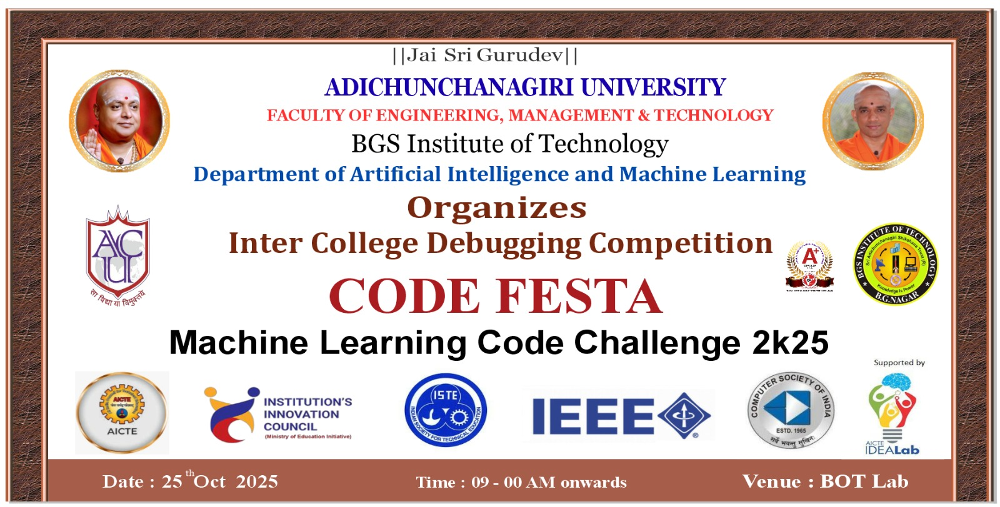

# 🚀 BGSIT – CodeFest Machine Learning Challenge 2025



Welcome to the **BGSIT CodeFest Machine Learning Challenge 2025**! This is an exciting 4-hour individual/team competition designed to test your data science and machine learning skills under time constraints.

## 🎯 Problem Statement

You are provided with a dataset and a target variable. Your task is to build a machine learning model that can accurately predict the specified target within the stipulated **4-hour event duration**.

This competition simulates a real-world data science project workflow, testing your ability to analyze, preprocess, model, and justify your decisions under time constraints.

## ⏰ Event Schedule

- **Event Duration**: 9:30 AM - 4:00 PM
- **Participant Working Time**: 4 hours total
  - **Session 1**: 11:00 AM - 1:00 PM (2 hours)
  - **Lunch Break**: 1:00 PM - 2:00 PM
  - **Session 2**: 2:00 PM - 3:00 PM (2 hours)
- **Evaluation Time**: 3:00 PM - 4:00 PM (1 hour)
- **Teams**: 45 teams from East West, Navkis, MIT, AIT, Chikmagaluru, PESITM

## 🛠️ Prerequisites

Before participating in the hackathon, ensure you have the following setup:

### 💻 Hardware Requirements
- **Laptop** with adequate processing power and memory

### 🖥️ Software Requirements

#### Essential Tools
1. **WSL (Windows Subsystem for Linux)**
   - Preferably **Ubuntu 22.04 LTS**
   - 📺 [Setup Tutorial Videos on YouTube](https://www.youtube.com/results?search_query=wsl+ubuntu+installation)

2. **Git**
   - Must be installed and configured
   - **CRITICAL**: You MUST know how to **FORK and CLONE** repositories

3. **Python** (Latest stable version recommended)
   - Python 3.8+ required

4. **Jupyter Notebook**
   - For interactive development and presentation

#### Package Managers (Choose one)
- **Anaconda** (Recommended for beginners)
- **Virtual Environment (venv)**
- **uv env package manager**

### 📚 Required Knowledge

Participants should have prior knowledge of:
- **Git basics**: clone, commit, push, pull
- **Git Fork and Clone workflow** ⚠️ **MANDATORY**
- Python programming fundamentals
- Basic data science concepts
- Jupyter Notebook usage

### 🆓 Allowed Resources

✅ **You CAN use:**
- **ChatGPT/LLMs/AI assistants** for coding help
- **Any open-source Python libraries**
- **Any publicly available machine learning models**
- **Online documentation and tutorials**

❌ **You CANNOT use:**
- Pre-trained models on the specific dataset
- External datasets other than provided
- Plagiarized code

## � Dataset Information

- A dataset will be provided at the **start of the event** (in CSV format)
- It will consist of:
  - **Training data** (with target variable)
  - **Test data** (without target variable)
- The dataset will contain a mix of:
  - Numerical features
  - Categorical features
  - Possibly missing values

## 👥 Team Format

- **Individual** or **Team participation** (max 3 members per team)
- At the end of 3 hours, teams must submit their complete project files + predictions

## ✅ Expectations from Participants

Each submission must include:

### 1. 🔍 Exploratory Data Analysis (EDA)
- Clean, structured, and insightful analysis
- Identification of patterns, distributions, outliers, correlations
- Clear visualizations (plots, charts, heatmaps, etc.)

### 2. 🧹 Data Preprocessing
- Handling missing values
- Feature engineering if required
- Encoding categorical variables
- Normalization/standardization if applicable

### 3. 🤖 Model Building
- Choice of ML model(s) should be **justified**
- You may use multiple models but must explain why you chose the final one
- Hyperparameter tuning is encouraged but must be explained clearly

### 4. 📈 Predictions
- Final predictions for the test dataset must be submitted as a `.csv` file

### 5. 📝 Documentation & Approach
- Clearly document your approach, reasoning, and steps taken
- Justify why your approach is effective for this problem

## 📦 Deliverables

Participants must submit the following before the deadline:

1. **Jupyter Notebook / Python Script**
   - Well-documented, clean, and reproducible

2. **Prediction File (CSV)**
   - File containing predictions for the given test dataset

3. **Brief Report** (1–2 pages or final notebook section)
   - Summary of EDA insights
   - Justification for chosen model
   - Explanation of approach

## ⚖️ Evaluation Criteria

Submissions will be evaluated on:

| Criteria | Weight | Description |
|----------|--------|-------------|
| **Model Performance** | 40% | Accuracy / RMSE / F1-score (depending on problem type) |
| **EDA & Insights** | 20% | Quality of data exploration, depth of insights and clarity of visualizations |
| **Approach & Justification** | 20% | Clarity in explaining steps, justification of preprocessing and model choice |
| **Clean Code & Presentation** | 20% | Code readability, comments, structure, and professionalism of submission |

## 📋 Rules

1. Participants must use **Python** (Jupyter Notebook, Colab, or IDE)
2. You are allowed to use public Python libraries (pandas, numpy, matplotlib, seaborn, scikit-learn, xgboost, lightgbm, etc.)
3. **No pre-trained models** or external datasets allowed (other than the one provided)
4. Any attempt at **plagiarism** or rule-breaking will lead to **disqualification**
5. All submissions must be made **before the 4-hour deadline**. Late submissions will **not be accepted**

## 🏆 Awards & Recognition

- **Top teams** will be awarded certificates & prizes
- **Winning projects** may be showcased on BGSIT platforms as model AIML case studies

## ⏱️ Pro Tip for Participants

**Time is short—plan your workflow:**
- **~1 hour**: EDA + preprocessing
- **~2 hours**: Modeling + tuning  
- **~1 hour**: Predictions + polishing your report


## 📁 Project Structure Template

```
BGSIT_Hackathon/
├── Notebooks/
│   ├── 01-exploratory_data_analysis.ipynb
│   ├── 02-model_development.ipynb
│   └── 03-dummy_for_testing.ipynb
├── README.md
├── data/
│   ├── processed/
│   │   └── bgsit_processed.csv
│   └── raw/
│       └── bgsit_raw_data.csv
├── extras/
│   ├── banner.jpg
│   └── docs.docx
├── model_artifacts/
│   └── model.pkl
├── submissions/
│   └── teamid-teamname.csv
└── test/
```

## 📋 Directory Guidelines

### 📓 `Notebooks/`
This folder contains Jupyter notebooks for your data science workflow:
- **`01-exploratory_data_analysis.ipynb`**: Initial data exploration, visualization, and insights
- **`02-model_development.ipynb`**: Model building, training, and evaluation
- **`03-dummy_for_testing.ipynb`**: Testing and validation scripts

**Important**: Follow the numerical naming convention for proper workflow organization.

### 📊 `data/`
Contains all dataset files:
- **`raw/`**: Original, unmodified datasets
  - `bgsit_raw_data.csv`: The provided raw dataset
- **`processed/`**: Cleaned and preprocessed data files
  - `bgsit_processed.csv`: Your processed dataset ready for modeling

### 🏗️ `model_artifacts/`
Store your trained models and related files:
- `model.pkl`: Your final trained model (pickle format)
- Additional model files, scalers, encoders, etc.

### 📤 `submissions/`
Final submission files:
- **`teamid-teamname.csv`**: Your prediction file for evaluation
- Format: Replace `teamid` with your assigned team ID and `teamname` with your team name

### 📁 `extras/`
Additional documentation and supplementary files:
- `banner.jpg`: Event banner image
- `docs.docx`: Project documentation, methodology, insights
- Any additional supporting files

### 🧪 `test/`
Testing scripts and validation code (optional)

## 🚀 Getting Started

### Step 1: Setup Your Environment
1. **Fork this repository** to your GitHub account
2. **Clone your forked repository** to your local environment
   ```bash
   git clone https://github.com/Chethanpatel/BGSIT_Hackathon.git
   cd BGSIT_Hackathon
   ```

### Step 2: Environment Setup
3. **Create a virtual environment** (recommended)
   ```bash
   # Using venv
   python -m venv hackathon_env
   source hackathon_env/bin/activate  # On Windows: hackathon_env\Scripts\activate
   
   # OR using conda
   conda create -n hackathon_env python=3.9
   conda activate hackathon_env
   ```

4. **Install required dependencies**
   ```bash
   pip install pandas numpy matplotlib seaborn scikit-learn jupyter
   # Add other libraries as needed: xgboost, lightgbm, plotly, etc.
   ```

### Step 3: Start Working
5. **Launch Jupyter Notebook**
   ```bash
   jupyter notebook
   ```

6. **Follow the notebook sequence**: Start with `01-exploratory_data_analysis.ipynb`

7. **Maintain the folder structure** throughout your project

8. **Document your work** in the notebooks with clear markdown explanations

## 📝 Submission Requirements

- ✅ Ensure your final model is saved in `model_artifacts/model.pkl`
- ✅ Submit predictions in `submissions/teamid-teamname.csv`
- ✅ Complete all three notebooks with proper documentation
- ✅ Include a brief methodology summary in `extras/docs.docx`
- ✅ All code should be reproducible and well-commented

## ⚠️ Important Notes

- **DO NOT** modify the basic folder structure
- Keep file naming conventions consistent
- Ensure your code is reproducible
- Comment your code thoroughly
- Include data preprocessing steps in the processed folder
- **Time management is crucial** - stick to the recommended timeline
- **Test your code** before final submission
- **Save frequently** to avoid losing work

## 🛠️ Recommended Python Libraries

### Essential Libraries
```python
import pandas as pd
import numpy as np
import matplotlib.pyplot as plt
import seaborn as sns
from sklearn.model_selection import train_test_split
from sklearn.preprocessing import StandardScaler, LabelEncoder
from sklearn.metrics import accuracy_score, classification_report
```

### Advanced Libraries (Optional)
```python
import xgboost as xgb
import lightgbm as lgb
import plotly.express as px
from sklearn.ensemble import RandomForestClassifier
from sklearn.linear_model import LogisticRegression
```

## 🆘 Troubleshooting & Support

### Common Issues
1. **Git Fork/Clone Problems**: Ensure you have proper Git credentials set up
2. **Environment Issues**: Make sure Python and required libraries are properly installed
3. **Jupyter Not Starting**: Check if Jupyter is installed in the correct environment
4. **Import Errors**: Verify all required libraries are installed

### Getting Help
- Use **ChatGPT/LLMs** for coding assistance
- Refer to **library documentation**
- Check **Stack Overflow** for common errors
- Ask **organizing team** for clarification on rules

---

## 🏆 **Good luck with the BGSIT CodeFest Machine Learning Challenge 2025! 🎯**

**Remember**: This is not just about winning - it's about learning, applying your skills, and having fun with data science!

For any questions or clarifications, please contact the organizing team.

---

*Last Updated: October 24, 2025*